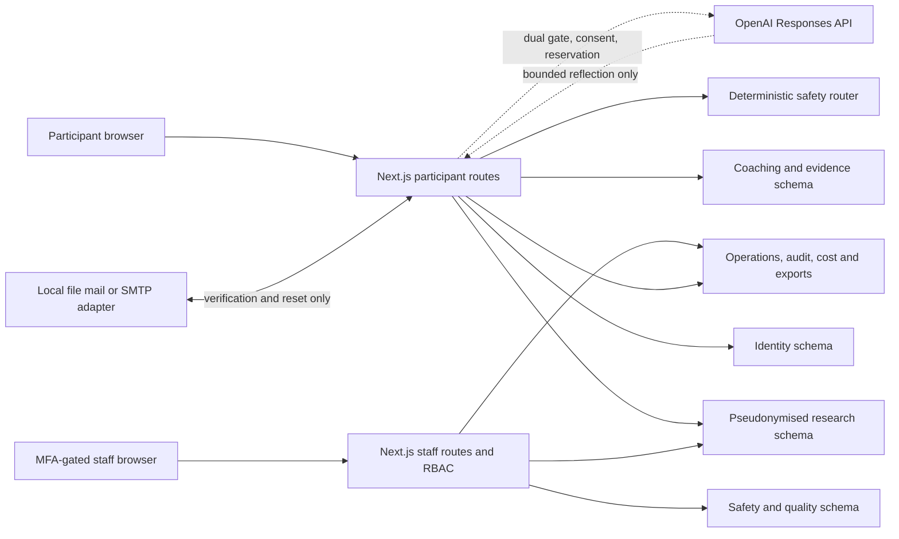

# Architecture and data flow

Status: implemented for synthetic/staff testing; live processing is not authorised.

The platform is a Next.js 16 modular monolith on Node 24. Route handlers own trust boundaries; React client components never receive database credentials or provider keys. Drizzle targets PostgreSQL. PGlite executes the same PostgreSQL schema for local and automated tests.

Contact identities live under `identity`; research observations use participant UUIDs and study codes under `research`; safety records are separate under `safety`; claims/interactions are under `coaching`; product events, costs, jobs, exports and hash-chained audit are under `operations`. Default analysis exports never join contact identities.

Every state-changing participant/staff API authenticates server-side, checks RBAC and CSRF, validates input with Zod, writes source observations, then writes audit/product events. Missing observations remain rows marked missing or absent follow-ups; they are never converted to success or failure.

The structured coach is authoritative. Optional AI sees a pseudonymous safety identifier, one bounded participant message and approved action options. It has no web, database, arbitrary tool or external-action access. Application-owned claims and citations are rehydrated after strict output validation.

Material decisions are recorded in [ADR 0001](adr/0001-standalone-data-and-safety-boundaries.md). The old vinext/Sites compatibility scaffold remains dormant; `npm run dev/build/start` use standard Next.js. No hosting choice is authorised by this architecture.
