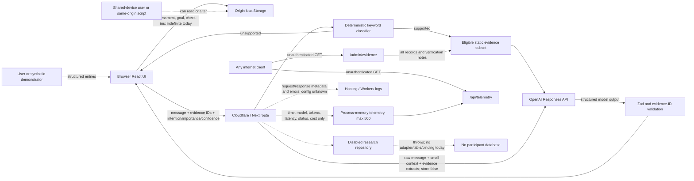

# Privacy and security threat model

**Review date:** 12 August 2026
**Reviewer role:** Privacy/Security Reviewer
**Scope:** the current repository and locally served implementation, not the proposed architecture alone
**Decision:** **do not expose this build to uncontrolled users or treat it as suitable for real participant data.** A controlled synthetic demonstration is defensible only after the public admin/telemetry surfaces, coach resource controls, browser-storage validation/deletion semantics, dependency findings, security headers and logging configuration are addressed.

This is a technical threat model, not legal advice, a DPIA, penetration test, supplier assurance or NHS security approval. No application code was changed as part of this review.

## Executive findings

The implementation has several good privacy properties: the OpenAI key is used only on the server; the coach has no tools, database access or live web access; patient-facing citations are rehydrated from eligible server records; model output is schema-checked and rendered as React text; application telemetry contains no prompt, profile, session ID or IP address; no real participant table or persistence adapter exists; and `store: false` is set on the Responses API call.

Those controls do not make the current build safe for public use. The most important observed gaps are:

1. **The paid coach route is anonymous and effectively unmetered.** `POST /api/coach` has no authentication, rate limit, concurrency limit, body-size gate, timeout, spend circuit breaker, content-type check or deployment guard. A bot or cross-site `text/plain` fetch can make the server parse a JSON body and consume model capacity. This is a high availability and cost risk.
2. **Developer surfaces are public.** `/admin/evidence` returns the complete evidence catalogue, including rejected/stale records and internal verification notes, and `/api/telemetry` returns exact recent request timestamps, model names, token counts, latency, success and cost. Both returned HTTP 200 without authentication in local testing. The Help page links to the admin route.
3. **Health-related browser state is persistent, readable and trusted too easily.** The app writes the complete structured assessment, goal and check-ins to one `localStorage` key indefinitely. A version check is the only validation on read. Any same-origin script, local machine user, browser profile reader or successful XSS can read or alter it.
4. **Deletion is local and narrower than the label implies.** The button removes the key and clears React state, but the persistence effect writes an empty envelope back immediately. It cannot delete platform invocation logs, OpenAI abuse-monitoring records, browser/device backups or anything copied before deletion. There is no confirmation, expiry or deletion receipt explaining what remains.
5. **`synthetic: true` is not an enforcement control.** Every state envelope is labelled synthetic even when a visitor has typed their own smoking and health information. This is dangerous metadata if analytics, export or persistence is later added.
6. **Prompt-injection detection is a short keyword list.** Obvious examples are rejected before generation, but obfuscation, multilingual instructions, payload splitting and indirect instruction-like evidence can pass. The model has low agency, which contains the blast radius, but the server validates structure and evidence IDs rather than semantic safety or claim entailment.
7. **Production logging and browser hardening are not configured or verified.** Application code does not log prompt content, which is positive. However, the local responses had no CSP, frame, referrer, content-type or explicit cache-control headers, and the repository does not define production Workers observability policy. Cloudflare invocation logs can include request/response metadata. Current `.devserver*.log` files are untracked but not ignored.
8. **The dependency gate is currently red.** A point-in-time `npm audit` found 20 advisories: 13 high, 6 moderate and 1 low. `npm audit --omit=dev` still reported one high transitive `ws` advisory. Directly affected packages include `react-server-dom-webpack`, `vinext`, `vite`, `@cloudflare/vite-plugin`, `drizzle-kit` and `wrangler`. Some are build-time or may not be reachable in the deployed bundle, but that must be demonstrated rather than assumed.

## Scope and method

I inspected the current routes, UI state handling, AI adapter and schemas, safety classifier, telemetry store, authentication helper, evidence admin page, worker and hosting configuration, research-persistence stub, example D1 route, package manifest/lockfile, ignore rules and existing architecture/safety reviews. I also:

- requested `/`, `/admin/evidence` and `/api/telemetry` from the running local server and inspected status and security headers;
- ran `npm audit --json` and `npm audit --omit=dev --json` on 12 August 2026;
- inspected the two untracked `.devserver` logs without exposing secrets; the error log currently contains only a local server/PID conflict and the other file is empty;
- checked current official OpenAI data-control documentation, Cloudflare Workers logging documentation, ICO guidance and OWASP guidance.

I did not test a deployed Cloudflare/Sites instance, inspect OpenAI or Cloudflare account settings, perform dynamic XSS scanning, brute-force the endpoint, incur model spend, inspect browser profile files, or attempt to bypass platform access controls.

## Assets

| Asset | Why it matters | Current location |
|---|---|---|
| Structured smoking/health state | Age band, consumption, dependence proxy, previous attempts, selected conditions, motivations, ratings, spend, goals and check-ins may be personal health/behaviour data | Browser `localStorage`, key `evidence-coach-demo-v1` |
| Coach free text and response | A user can enter names, contact details, symptoms, medicines or other identifiable health narrative despite the warning | React memory; transient request; OpenAI request/response; possible provider/platform logs |
| Minimized coach context | Intention, importance and confidence are sent with every supported coach message | Server request and OpenAI input |
| Evidence catalogue and verification notes | Integrity controls what health information appears; rejected/stale notes can reveal internal reasoning and weaknesses | Server bundle and public `/admin/evidence` |
| OpenAI API key and project spend | Secret compromise or endpoint abuse creates financial and service risk | Server environment; invoked by `/api/coach` |
| System prompt and safety policy | Not a credential, but disclosure/manipulation helps bypass health boundaries and misrepresent system capability | Server bundle/model input |
| Operational telemetry | Exact request time, model, token counts, latency, status and cost can reveal usage and assist reconnaissance | Process-global memory; public `/api/telemetry` |
| Application and platform logs | May contain URL, metadata, errors, headers or accidentally added content | Cloudflare/hosting observability; local `.wrangler`; untracked `.devserver*.log` |
| Source/build integrity | A compromised dependency or build step can read local state, steal keys, alter evidence or inject script | `package-lock.json`, npm packages, CI/developer machine |
| Future participant repository boundary | Accidental enablement would turn a local demo into remote special-category data processing | Fail-closed stub; currently no real adapter/table/binding |

If a real identifiable person uses the tool, the smoking, condition and mental-wellbeing fields can become health-related personal data; local storage does not make them anonymous. ICO guidance requires extra care with minimisation, security, transparency and retention for special-category data. The appropriate legal basis, Article 9 condition and DPIA are governance decisions outside this code review.

## Trust boundaries and threat actors

### Trust boundaries

1. **Person to browser UI.** Input is untrusted even when the UI calls it synthetic.
2. **One browser user to another.** `localStorage` is origin-wide and persists across sessions on a shared profile.
3. **Browser application to same-origin scripts/dependencies.** Any script executing in the origin can access the local envelope and call same-origin APIs.
4. **Public internet to Cloudflare/Next route handlers.** The coach, admin page and telemetry API have no application authorization boundary.
5. **Route handler to OpenAI.** Raw free text, three context values and selected evidence extracts leave the application boundary.
6. **Runtime to operator/platform observability.** Even content-free application telemetry does not control CDN, edge, exception or supplier logs.
7. **Developer/build environment to production.** Beta framework/tooling and dependency updates can alter headers, route behavior and server/client bundling.
8. **Current demo to future research persistence.** A future adapter would cross from device-local data into centrally controlled participant records and requires a new threat model.

### Plausible threat actors

- another person using the same phone, tablet, kiosk or browser profile;
- an anonymous bot seeking to exhaust model spend or availability;
- a malicious or curious user testing prompt boundaries;
- a malicious page causing cross-site requests, or a same-origin XSS/supply-chain script;
- an authenticated ChatGPT/Sites user who is not an authorized administrator;
- a developer who copies the unauthenticated D1 example or enables persistence without governance;
- an operator, support user or compromised observability account with log access;
- a compromised package, package maintainer, build runner or developer workstation.

## Privacy data flow

The coach conversation is not written to the application’s `localStorage`; it exists in component memory until navigation/unmount. That is a useful minimisation property. It is still transmitted externally when the OpenAI key is configured.

## Data inventory, retention and deletion reality

| Store/process | Actual fields | Current retention | Who can access | Delete button effect |
|---|---|---|---|---|
| Browser `localStorage` | Entire `DemoState`: assessment, goal, check-ins and `synthetic` flag | No expiry; until button/browser/site-data clearing or profile deletion | Same-origin JavaScript and people/processes with browser-profile access | Health content is cleared; an empty envelope is likely written back by the persistence effect |
| Browser component memory | Coach message and response | Until page/component lifecycle ends | Current tab and executing same-origin script | Navigation to landing unmounts the coach; not independently described |
| Coach route | Message, up to six client-supplied evidence IDs, intention, importance, confidence | No intentional application persistence | Server process during request | No effect after transmission |
| OpenAI request | Raw message, three context values, eligible evidence summaries/findings/certainty/limitations, system instructions | `store: false` avoids normal Responses application-state storage, but default abuse-monitoring logs may contain prompts/responses and are retained up to 30 days unless approved controls apply | OpenAI under project/account controls | Local button has no effect |
| Application telemetry | Timestamp, model, input/output tokens, latency, success, approximate USD cost | Last 500 events for process lifetime; resets across isolates/restarts | Anyone who can GET `/api/telemetry` | No effect |
| Hosting/Workers logs | At least invocation method/URL and related metadata when enabled; custom logs/errors if emitted | Production configuration not present in the repository; Cloudflare documents plan-dependent retention up to 7 days for Workers Logs | Cloudflare account users/integrations with access | No effect |
| Static evidence/admin data | Full catalogue, including non-patient-facing records and verification notes | Version-controlled/deployed until changed | Public through `/admin/evidence` today | No effect |
| Research participant database | None | None | None | Not applicable |

Official OpenAI documentation says API data is not used to train models by default unless the customer opts in, but default abuse-monitoring logs may include prompts/responses and be retained for up to 30 days. `store: false` is therefore **not** a zero-data-retention guarantee. Zero Data Retention or Modified Abuse Monitoring requires eligible-customer approval and project/organization configuration; this repository cannot prove those controls are active.

## Attack and misuse table

Risk combines current likelihood and impact for an internet-reachable prototype. “Controlled demo” means access restricted to named demonstrators using synthetic personas on managed/non-shared devices.

| ID | Threat / path | Existing controls | Likelihood | Impact | Risk | Required treatment |
|---|---|---|---|---|---|---|
| T01 | Shared-device user opens the site and sees a previous person’s assessment, conditions, plan and check-ins | Prototype warning and delete button | Likely | High confidentiality/stigma harm | **High** | Default to memory/session storage or explicit opt-in persistence; short expiry; shared-device warning before save; controlled access |
| T02 | XSS or compromised same-origin dependency exfiltrates or alters local health state | React escapes rendered strings; no raw HTML found | Possible | High | **High** | Strict CSP and dependency gate; validate storage as hostile; minimize/expire data; do not claim local storage is secure |
| T03 | Well-formed but malicious/corrupt `localStorage` causes crashes, misleading values or oversized rendering | Only `version === 1` check | Likely over product life | Medium | **High** | Parse with a strict runtime schema, bounds and migration; reject/quarantine invalid/oversized envelopes |
| T04 | Anonymous bot loops `/api/coach`, exhausting OpenAI spend or worker capacity | 800-character message limit after JSON parse; provider account limits may exist but are unverified | Likely if public | High | **High** | Gateway and application rate limits, concurrency/timeout/token/body caps, budgets/alerts and kill switch |
| T05 | Cross-site page sends a `text/plain` JSON POST that triggers spend even though CORS prevents reading the response | No content-type, Origin or Fetch Metadata enforcement | Possible | Medium/High | **High** | Require JSON, reject cross-site `Sec-Fetch-Site`, validate allowed Origin as defense-in-depth; do not treat this as authentication |
| T06 | Huge JSON body or huge unknown property consumes memory before Zod rejects/strips it | Message and array limits apply only after `request.json()`; object is not strict | Likely for a public route | Medium/High availability | **High** | Enforce Content-Length/stream byte cap before parsing; strict schema; bound each evidence ID; 413 response |
| T07 | Slow/upstream model call ties up workers or causes retry/cost amplification | Generic catch and static no-key fallback | Possible | High | **High** | Abort timeout, concurrency cap, retry budget, maximum output tokens, idempotency/replay strategy and circuit breaker |
| T08 | Obfuscated or multilingual prompt injection bypasses the keyword regex and elicits unsafe health content or prompt details | No tools/web/DB; system prompt; Zod output; allowed evidence-ID check | Likely in adversarial use | High clinical/reputational impact | **High** | Treat injection as inevitable; add semantic policy validation, evidence entailment checks, adversarial corpus and fail-closed fallback |
| T09 | Model cites a real eligible ID while misstating what it supports | Unknown IDs rejected; every non-empty claim needs an allowed ID | Possible | High | **High** | Deterministic claims where possible; claim-to-field/quote entailment validator; suppress rather than merely attach citations |
| T10 | User enters identifiable health narrative despite the notice; it is sent to OpenAI and possibly abuse logs | 800-character cap; warning; minimized structured context; `store: false` | Likely once public | High privacy impact | **High** | Remove free text from uncontrolled V1 or gate to synthetic demo; pre-send privacy notice; evaluate PII redaction without promising completeness; supplier/DPIA controls before real use |
| T11 | User believes “Delete my demo data” removes all copies | Help mentions OpenAI and caveat, but deletion scope/remaining data is not confirmed | Likely misunderstanding | High trust/privacy impact | **High** | Rename to “Delete data from this browser”; confirmation and receipt listing local deletion and external records not affected |
| T12 | Public visitor reads full evidence admin data, including rejected/stale records and internal verification notes | Read-only page and “developer/admin” label | Certain now | Medium; could aid misinformation/reconnaissance and disclose internal review | **High** | Route absent from public builds or protected by platform access policy plus server-side role authorization |
| T13 | Public visitor reads exact recent operational telemetry | Content-minimized, no user/session fields, process-local max 500 | Certain after calls occur | Medium | **Medium** | Remove public route; authenticated internal aggregate only; coarsen/delay timestamps; `no-store` |
| T14 | Hosting or future custom logs capture prompts, responses, headers or errors | No application `console.*` logging found; generic client error | Configuration drift is plausible | High if content logged | **High** | Explicit allowlisted logging policy; inspect deployed logs; redaction tests; least-privilege log access and retention |
| T15 | Missing browser/API security headers increases XSS, clickjacking and leakage impact | External links use `rel=noreferrer` | Observed locally | High when combined with local health state | **High** | CSP with nonces/hashes, `frame-ancestors`, `nosniff`, referrer/permissions policy, HSTS at edge; API `no-store` |
| T16 | Vulnerable/build-chain dependency compromises developer, CI or runtime | Lockfile present; no automatic remote scripts in app flow | Audit reports known issues | High | **High** | Controlled upgrades, reachability review, audit gate, SBOM/provenance and ongoing dependency alerts |
| T17 | A future developer trusts `synthetic: true` and exports or persists real user entries as “non-personal” | UI warnings and synthetic personas | Possible | High governance/privacy impact | **High** | Separate immutable demo-persona provenance from user-entered data; never auto-label user input synthetic |
| T18 | D1 example route is copied into the app, creating an unauthenticated arbitrary notes store with raw error disclosure | It is under `examples/`, not routed or deployed today | Unlikely today; plausible drift | High if reused for health data | **Medium** | Exclude examples from production artefacts/tests; add warning; forbid persistence adapters/routes via architecture test |
| T19 | A feature flag or D1 binding silently enables remote participant storage | Current repository has only an interface, throwing disabled adapter, false constant, empty schema and `d1: null` | Unlikely today | Critical if real data later flows | **Low now / Critical future** | Preserve absence of real adapter; governed separate change set and deployment; fail-closed tests at build/startup |
| T20 | Identity headers are treated as administrator authorization | Auth helper is currently unused; README correctly says identity does not prove workspace membership | Possible in future implementation | High | **Medium** | Use hosting access policy and explicit server-side role/allowlist; protect origin so clients cannot spoof trusted headers |

## Detailed control review

### Browser storage and deletion

`src/ui/CoachApp.tsx:12-32` writes a versioned `DemoState` to `localStorage`. The state includes the fields listed in `src/domain/types.ts:51-94`. This is persistent origin-wide browser data, not a security boundary. OWASP specifically advises against storing sensitive information in local storage, notes that XSS can read or poison it, and says values must not be trusted merely because they came from local storage.

The current cast `JSON.parse(saved) as DemoState` is compile-time only. An attacker or stale client can supply missing arrays, wrong enums, invalid dates, negative/extreme values outside form constraints or a very large check-in list. Subsequent `.includes`, `.map`, arithmetic and date rendering assume valid shapes. Use a strict schema with maximum serialized size, exact enums, bounded arrays/numbers/strings, valid dates, a migration policy and a fail-safe clear/quarantine path.

For this prototype, encryption in browser JavaScript would not solve same-origin XSS: the decryption key must also be available to the application. The safer design is data minimisation, controlled devices, short retention and no persistence by default. If cross-session persistence remains essential, make it an explicit choice after plain disclosure and store an expiry/notice version. Do not collect extra data merely to authenticate local storage.

`deleteData()` does remove the health-bearing key and resets state. Because the second effect persists every state update, it then writes the empty envelope again. More importantly, it cannot revoke data already transmitted to OpenAI or copied to platform logs/backups. The button must identify the exact browser stores it clears, clear any future cache/IndexedDB/service-worker data by an allowlisted storage inventory, clear conversation/component state, avoid immediate key recreation, and announce completion. It should not promise server/provider erasure.

### Coach API and abuse boundary

`app/api/coach/route.ts:7-21` is reachable without an application identity check. `app/chatgpt-auth.ts` is not imported by the route or admin page. Even if a host injects authenticated-user headers, identity is not authorization and the repository itself warns that it does not prove workspace membership.

The Zod request schema usefully caps the post-parse message at 800 characters, evidence ID count at six, and rating ranges. It does not cap bytes before JSON parsing, cap individual ID length, reject unknown properties, require JSON content type or constrain request frequency. Zod object parsing strips unknown keys by default, so a huge unused property can still be parsed into memory first.

Required protections are layered:

- restrict the entire prototype to controlled users until a public threat model and DPIA are approved;
- apply edge and application rate limits, with global, network/device and authenticated-principal dimensions as appropriate;
- enforce a small raw-body byte cap before parse, `application/json`, a strict schema and bounded IDs;
- use Origin/Fetch Metadata to stop browser drive-by requests, while recognizing non-browser clients can spoof them;
- cap model input/output tokens, execution time, concurrent calls and retries;
- set provider/project spend limits or alerts and an automated kill switch;
- return 413/415/429/503 accurately without echoing bodies and with `Cache-Control: no-store`;
- ensure fallback mode remains functional when model access is disabled.

OWASP identifies missing execution timeouts, payload limits, request-rate limits and third-party spend limits as unrestricted resource-consumption risks.

### Prompt injection and model boundary

`src/domain/safety.ts:3-13` blocks a small set of literal phrases. This catches the test examples in the brief but is not a general injection control. Encoding, euphemism, spacing, another language, adversarial suffixes or a split instruction can evade it. OWASP describes prompt injection as inherent to LLM processing and states that RAG and fine-tuning do not fully eliminate it.

The current model blast radius is relatively contained: it has no tools, web, storage, database or URL fetch; evidence is server-selected; the system prompt labels evidence and user content untrusted; structured output is parsed; unknown/non-eligible evidence IDs are rejected; and React does not render model HTML. No SSRF or natural-language database execution path was found.

The remaining high-risk outcome is persuasive, medically unsafe text carrying a valid-looking citation. A valid evidence ID proves only that the record exists, not that the generated claim is entailed. Post-generation code should reject diagnosis, triage, personal medicine selection, emergency reassurance, exact personal prediction, ungrounded numbers, system-prompt disclosure attempts and claims whose cited structured evidence fields do not support them. Prefer deterministic approved text for health facts and safety exits. Maintain a multilingual/obfuscated injection and citation-laundering regression corpus. Never give this coach tools or privileged actions merely because an input classifier has improved.

### OpenAI processing

`src/ai/coach.ts:14-32` keeps the key server-side and sends only the raw message, `{ intention, importance, confidence }`, and selected eligible evidence extracts. It does **not** send the entire assessment, named conditions, cigarette count, years smoked, goal or check-in history. This is a meaningful minimisation success and should be preserved with a payload snapshot test.

The UI disclosure is still incomplete. The landing statement “Demo data stays in this browser” is too broad because coach messages/context leave the device. The Help copy mentions the transfer and `store: false`, but should also name the evidence excerpts, supplier, purpose, default abuse-monitoring possibility, configured region/retention if verified, and the fact that browser deletion cannot delete supplier records. Do not state that Zero Data Retention, regional processing or NHS contractual safeguards exist until account configuration and contracts have been evidenced.

For any use involving real identifiable health information, the organization must resolve controller/processor roles, lawful basis and special-category condition, DPIA, supplier terms, access controls, incident handling, international/data-residency position, retention and data-subject rights. Those cannot be supplied by an SDK parameter.

### Telemetry and admin exposure

`src/telemetry/store.ts` deliberately excludes message/profile/session/IP content and keeps only the latest 500 process-memory events. That is good data minimisation. However, `app/api/telemetry/route.ts` exposes the complete summary and last 20 exact events to any caller. It also has no `no-store` response policy. Process-local telemetry is not an accurate system-wide source on a multi-isolate/serverless deployment and therefore creates exposure without reliable research measurement.

`app/admin/evidence/page.tsx` is also unauthenticated and linked from Help. “Developer/admin” and “read-only” are labels, not access controls. It exposes every record, including non-patient-facing items and `verificationNotes`. Public source citations are appropriate; internal verification workflow and rejected/stale catalogue entries are not required for patient use.

In a public build, both routes should be absent. In a controlled admin deployment, require upstream/private-site access plus application role authorization, least privilege, MFA where supported, audit of access and a protected origin that does not accept spoofed identity headers. The telemetry view should use coarse aggregates and restricted date ranges, not exact recent event rows by default.

### Server and platform logs

No `console.log`, prompt logging or raw exception response was found in application code. The route’s catch returns generic text and its custom telemetry contains no content. Those are positive controls.

This does not establish production log behavior. The repository has no deployed Workers observability policy. Cloudflare documents that Workers invocation logs can contain request/response and related metadata, displays fetch method and URL, supports disabling invocation logs, and retains Workers Logs for up to seven days depending on plan. The correct setting depends on operational need; it must be explicit, tested and documented. Query strings must never carry health content, logs must use allowlisted fields only, errors must not serialize request bodies, and log access/exports/retention must be reviewed.

The current local `.devserver.err.log` contains only a server-conflict message with a local path and PID; `.devserver.log` is empty. Both are untracked and are not covered by `.gitignore`. Ignore local server logs and document that developers must not paste request bodies or secrets into diagnostic output.

### Security headers and browser isolation

Local HTTP inspection found no `Content-Security-Policy`, `X-Frame-Options`/`frame-ancestors`, `X-Content-Type-Options`, `Referrer-Policy` or explicit `Cache-Control` on `/`, `/admin/evidence` or `/api/telemetry`. A production edge may add some headers, so this must be re-tested after deployment. The app should define rather than assume them.

Use a restrictive CSP compatible with the framework, preferably nonce/hash based, with `object-src 'none'`, `base-uri 'none'`, a tight `connect-src`, and `frame-ancestors 'none'`. Add `nosniff`, a conservative referrer policy, a minimal Permissions Policy, and HSTS at the HTTPS edge. Mark coach, telemetry and admin responses `no-store`. Do not use a permissive CSP merely to make beta tooling work in production.

### Dependency posture

The lockfile provides reproducibility, but the current audit is a release blocker until triaged:

| Audit scope on 12 Aug 2026 | Result |
|---|---|
| `npm audit --json` | 20 total: 13 high, 6 moderate, 1 low, 0 critical |
| Direct packages reported | `react-server-dom-webpack` high; `vinext` high; `vite` high; `@cloudflare/vite-plugin` moderate; `drizzle-kit` moderate; `wrangler` moderate |
| `npm audit --omit=dev --json` | 1 high transitive `ws` advisory |

The audit suggests straightforward non-major updates for some direct packages, such as `react-server-dom-webpack` 19.2.8, Vite 8.2.1 and `@cloudflare/vite-plugin` 1.51.3. Its suggested `vinext` and `drizzle-kit` fixes involve incompatible or suspicious version movement and must not be applied blindly. `vinext` itself is a beta, increasing framework and patch uncertainty.

Upgrade through a reviewed branch, rebuild and rerun unit/render/security tests, inspect the deployed dependency graph, and document any accepted advisory with reachability and expiry. Add an automated audit/advisory gate, update monitoring, lockfile review, dependency provenance controls and an SBOM for release. Build-time vulnerabilities matter because CI/developer compromise can alter the deployed application even when a package is not runtime-reachable.

### Future research persistence

The current implementation is safer than a dormant production adapter:

- `src/infrastructure/research-persistence.ts` defines a narrow interface and a `DisabledResearchParticipantRepository` that always throws;
- `REMOTE_PARTICIPANT_STORAGE_ENABLED` is a compile-time false constant;
- there is no real participant adapter, route or table;
- `db/schema.ts` is empty; and
- `.openai/hosting.json` declares `d1: null` and `r2: null`.

This is a strong fail-closed posture, although the interface/constant are unused and therefore not yet guarded by tests. The repository also contains an unauthenticated notes API as a D1 example outside the active `app` tree. It is not deployed today, but it is a copy/paste hazard.

Do **not** satisfy the master brief by adding a dormant real health-data adapter behind one environment flag. Preserve the port and throwing implementation only. A future research pilot should add its adapter, schema, identity/authorization, consent/research identifiers, retention/deletion, audit, key management, backups, subject rights and incident controls in a separately governed change and environment after DPIA/research/clinical-safety approvals. Add a build test that fails if a participant table, enabled binding, persistence route or non-disabled implementation appears without an explicit governance release marker.

## Required code and configuration changes

### P0 before any externally reachable or real person demonstration

1. **Restrict exposure.** Put the entire prototype behind a controlled hosting access policy. Make `/admin/evidence` and `/api/telemetry` absent from public builds; if retained internally, add server-side role authorization rather than mere identity-header presence.
2. **Harden `/api/coach`.** Add raw-body size, JSON content-type, strict schema/per-field limits, edge/application rate limits, cross-site request defenses, concurrency cap, upstream abort timeout, output-token cap, spend alert/circuit breaker, accurate status codes and `no-store`.
3. **Treat model output as untrusted.** Add deterministic semantic safety and claim-entailment validation with a fail-closed approved fallback; run a multilingual/obfuscated prompt-injection and citation-laundering test corpus.
4. **Fix local state handling.** Introduce a strict `DemoState` read schema, size/array bounds, expiry/migration and invalid-state recovery. Prefer session/memory by default; if persistent storage remains, require an explicit user choice and shared-device warning.
5. **Make privacy copy exact.** Replace “Demo data stays in this browser” with a field-specific statement. Before coach submission, explain that the message, three context values and evidence excerpts are sent to OpenAI and that the local delete action does not erase provider/platform logs.
6. **Correct deletion semantics.** Confirm, clear the enumerated local stores and coach state, prevent immediate key recreation, return to a safe screen, and show a persistent completion receipt describing what was and was not deleted.
7. **Remove false synthetic provenance.** Synthetic personas may carry immutable demo provenance; user-entered state must not automatically be labelled synthetic.
8. **Patch or formally disposition dependency findings.** At minimum resolve deployable/reachable high advisories and the direct React/Vite/Cloudflare chain findings, with build/regression verification.
9. **Define and test production headers/logging.** Add a strict CSP and other headers, set API `no-store`, make Workers observability/retention explicit, and prove no request/response body or secrets appear in deployed logs.

### P1 required for a credible governed prototype

1. Create an owned data inventory and privacy notice covering browser state, transient API processing, OpenAI, Cloudflare/hosting, operational telemetry, retention, deletion limits and user rights/contact routes.
2. Add automated tests for public-route absence/authorization, storage poisoning, deletion, request limits, log redaction, security headers, prompt injection, claim entailment and browser-bundle secret scanning.
3. Replace event-level public telemetry with access-controlled, coarse, content-free aggregates; test that no local session or stable cross-session identifier is introduced.
4. Pin/evaluate a model snapshot where available and require regression review when model, prompt, SDK, evidence, hosting or safety policy changes.
5. Ignore `.devserver*.log`, keep local and CI logs out of source control, and add secret scanning for commits/build artefacts.
6. Add an architecture test that proves participant persistence is absent and fails closed, including `d1: null`, empty participant schema and no active adapter/route.
7. Remove or clearly quarantine the D1 example from production build/release artefacts and add a warning that it is unauthenticated demo code, not a persistence template for health data.

### P2 before a real participant pilot

1. Complete a DPIA and supplier/security assurance with the responsible organization; evidence controller/processor roles, lawful basis and Article 9 condition, contracts, retention, data location, access control, breach handling and subject-rights procedures.
2. Decide whether free-text AI coaching is necessary to the research question. If not, remove it; if it is, separately justify and test PII minimisation/redaction and obtain the required OpenAI project controls rather than relying on `store: false`.
3. Establish vulnerability management, SBOM, patch SLAs, dependency provenance, incident response, security monitoring and periodic penetration testing.
4. Design future remote persistence as a new governed system with participant identity separation, a schema for the stated purpose, least privilege, encryption and key management, auditable access, backup deletion and tested retention and erasure. Do not treat this as a flag flip.

## Security acceptance criteria

The following are concrete release tests, not documentation-only controls:

1. In a production build, unauthenticated and authenticated-but-unauthorized requests to `/admin/evidence` and `/api/telemetry` return 404 or 403; direct-origin access cannot bypass the edge policy.
2. A coach request over the byte limit is rejected with 413 before JSON parsing and before any OpenAI call. Wrong content type returns 415. Unknown fields and overlong evidence IDs are rejected.
3. Rate/concurrency tests produce 429/503 with no uncontrolled provider spend; the provider timeout aborts cleanly and does not retry indefinitely.
4. Cross-site browser requests are rejected using content type and Fetch Metadata/Origin defense-in-depth; tests acknowledge that this does not replace authentication/rate limiting.
5. Payload snapshots prove that only message, intention, importance, confidence and the intended evidence extracts leave the application. Assessment conditions, cigarette count, age, goal, check-ins and local IDs do not.
6. A corpus covering English/non-English, encoding, spacing, suffixes, role play, payload splitting and prompt extraction cannot cause tools/web/DB use, personal medicine advice, diagnosis, emergency reassurance, hidden-prompt output, fabricated citations or unsupported cited claims.
7. Corrupt, oversized and adversarial version-1 local envelopes are rejected without executing script, displaying untrusted HTML, crashing the app or producing misleading calculations.
8. Deletion removes every documented local store and conversation state, does not recreate the key, announces success and accurately states that provider/platform retention is unaffected.
9. Deployed responses carry the approved CSP, frame protection, `nosniff`, referrer and permissions policies; sensitive API/admin responses are `no-store`. Automated checks are supplemented by browser CSP violation review.
10. Deployed platform/application logs contain no prompt, response, assessment, local identifier, authorization header, API key or raw request body across success, validation failure, timeout and exception paths.
11. Browser bundles and source maps contain no OpenAI key or server-only secret. The secret is scoped to the intended project and rotation is tested.
12. Dependency audit/reachability policy passes or has named, time-limited exceptions. Reproducible build and SBOM checks run in CI.
13. A persistence guard test fails if a participant table, D1/R2 binding, save route, enabled adapter or runtime flag is added without the separately approved release marker.

## Assumptions

1. The local server reflects application route behavior, but the production hosting layer may add authentication, headers, WAF/rate limits or observability not visible in the repository.
2. No external gateway currently rate-limits `/api/coach`; none is documented or testable here.
3. The OpenAI project uses default data controls because ZDR/MAM, data residency and account contracts were not available for inspection. This is deliberately conservative.
4. Workers Logs/other platform logging settings and account access controls are unknown. The review does not claim prompt bodies are currently logged by Cloudflare.
5. Users will sometimes enter real information regardless of “synthetic” copy if the URL looks usable.
6. Evidence URLs and records are developer-controlled static data today; the patient coach has no arbitrary fetch or tool surface.
7. The current admin verification notes contain no participant data, but they are not intended public content.
8. `npm audit` is a point-in-time advisory match, not proof that each advisory is reachable or exploitable in the deployed worker.
9. No service worker, IndexedDB, cookie-based user state, analytics SDK or remote participant store exists in the inspected implementation.

## Major risks after P0

- A model can still produce a clinically misleading paraphrase despite injection tests and schemas; generative text cannot be treated as a deterministic safety control.
- A browser-local prototype remains unsuitable for confidential use on shared/unmanaged devices even with expiry, CSP and clear copy.
- Supplier/account settings, edge configuration and operator practice can drift outside the repository.
- A polished public URL will attract real disclosures and adversarial traffic; copy cannot enforce synthetic use.
- Dependency and beta-framework behavior can change the security boundary faster than static review cycles.
- Future research persistence changes the controller, authorization, retention, rights and incident model so substantially that this V1 review cannot approve it by extension.

## Disagreements and design challenges

1. **“Local-first” is not equivalent to private or anonymous.** It reduces central collection but moves confidentiality to the device, browser profile, same-origin JavaScript and shared-user context. Persistent local storage should not be the default merely because no database exists.
2. **Do not add a real research adapter behind a single feature flag.** The master brief asks for disabled feature-flag persistence; the architecture review’s narrower interface plus always-throwing adapter is safer. Enabling real participant storage must be a separately governed implementation and deployment, not configuration drift.
3. **“Developer/admin” and “read-only” are not security controls.** An internal label on a public route does not create authorization, and read access can expose rejected evidence, verification weaknesses and operational data.
4. **The `synthetic` boolean is actively misleading for user-entered data.** A notice cannot make real entries fictional. Provenance must describe how data was created, not how the application wishes it had been created.
5. **The keyword injection route is a test fixture, not a defense.** It can reduce obvious abuse but must not be described as preventing prompt injection.
6. **`store: false` is useful but narrow.** It does not establish zero retention, data residency, NHS approval, or deletion from abuse-monitoring logs.
7. **Content-free telemetry can still be sensitive operational data.** Exact recent times, errors, model and cost need not be public, and the current process-local store is not reliable evaluation instrumentation anyway.
8. **A read-only evidence dashboard should not share the patient deployment.** Public provenance belongs in curated evidence cards; internal verification notes and rejected/stale records belong behind a separate control plane.

## Confidence

- **High confidence:** code-path findings for local storage, deletion, API validation, model payload, prompt classifier, telemetry, public admin/API routes, fail-closed persistence and absence of application content logging.
- **High confidence:** the anonymous coach route lacks in-repository resource controls and is vulnerable to cost/availability abuse if exposed directly.
- **Moderate confidence:** production header and log risks because only the local server and repository configuration were available; a hosting control plane may add protections.
- **Moderate confidence:** dependency severity in this specific deployment because advisory matching does not prove reachability, especially for dev/build packages.
- **Moderate confidence:** UK data-protection implications; the data categories and controls are clear, but controller status, lawful basis, research status and contracts require organizational/legal review.

## What is most likely wrong here?

1. **The live hosting control plane may already restrict access or add headers/rate limits.** If so, some exposure likelihoods fall, but the application remains unsafe when moved, previewed or directly addressed because those controls are not expressed or tested in the repository.
2. **OpenAI project controls may be stronger than assumed.** Approved ZDR/MAM or regional settings would reduce supplier retention risk. The UI still must not infer those settings from `store: false`; they need evidence and monitoring.
3. **Cloudflare logging behavior may differ for Sites from generic Workers documentation.** The precise fields and retention must be verified on the actual deployment. The review therefore marks log content as unknown rather than claiming prompts are logged.
4. **The shared-device risk may be acceptable for a supervised conference demo using synthetic personas.** It is not acceptable for an uncontrolled public URL inviting users to enter their own smoking/condition data.
5. **Some npm advisories may be non-reachable in the production worker.** The current counts may overstate runtime exploitability, while understating build-chain risk. Reachability and patched build testing should decide, not the count alone.
6. **The largest practical harm may be clinical misinformation rather than data exfiltration.** This threat model focuses on privacy/security, but citation laundering and safety-boundary bypass can cause more direct harm and must be owned jointly with clinical safety.
7. **A future “temporary” analytics or persistence change is likely to create the first real privacy incident.** The current implementation is data-minimal server-side; its main danger is stakeholders treating that posture as durable without architecture tests and change governance.

## Sources

- OpenAI, [Data controls in the OpenAI platform](https://developers.openai.com/api/docs/guides/your-data#default-usage-policies-by-endpoint), covering default training posture, abuse monitoring logs, retention controls, endpoint application state and data residency.
- OWASP, [HTML5 Security Cheat Sheet: Local Storage](https://cheatsheetseries.owasp.org/cheatsheets/HTML5_Security_Cheat_Sheet.html#local-storage), covering same origin exposure, XSS theft or poisoning, persistence and treating local data as untrusted.
- OWASP, [API4:2023 Unrestricted Resource Consumption](https://owasp.org/API-Security/editions/2023/en/0xa4-unrestricted-resource-consumption/), covering request, payload, timeout and third party spend controls.
- OWASP GenAI Security Project, [LLM01:2025 Prompt Injection](https://genai.owasp.org/llmrisk/llm01-prompt-injection/), covering direct and indirect injection, obfuscation and the limits of layered defences.
- Cloudflare, [Workers Logs](https://developers.cloudflare.com/workers/observability/logs/workers-logs/), covering invocation metadata, configuration, sampling and maximum retention.
- ICO, [What are the rules on special category data?](https://ico.org.uk/for-organisations/uk-gdpr-guidance-and-resources/lawful-basis/special-category-data/what-are-the-rules-on-special-category-data/), covering lawful basis and condition, DPIA, minimisation, security, transparency and documentation.
- ICO, [Principle (e): Storage limitation](https://ico.org.uk/for-organisations/uk-gdpr-guidance-and-resources/data-protection-principles/a-guide-to-the-data-protection-principles/storage-limitation/), covering justified retention, review and erasure or anonymisation.
