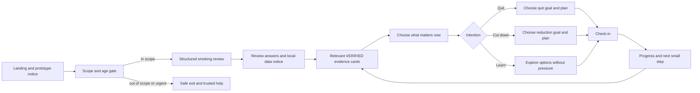

# MPFT Evidence Coach: Product Architecture Review

**Role:** Product Architect
**Date:** 12 August 2026
**Status:** Proposed architecture; requires independent clinical-safety, evidence-methodology, privacy/security, behaviour-change and accessibility review before implementation is treated as complete
**Basis:** The 53-section master build instruction. The workspace was empty at initial inspection and acquired a vinext/React/Cloudflare/Drizzle scaffold during this parallel review, so this remains a greenfield proposal but the stack recommendation below reflects that active scaffold.

## Executive decision

Build V1 as a mobile-first, guided smoking-cessation research prototype in a **modular monolith**. Its core experience must work without generative AI: structured assessment, deterministic evidence relevance, approved evidence cards, user-selected goals, check-ins, progress calculations, safety exits and trusted resources. AI is an optional server-side enhancement for bounded coaching and plain-language synthesis; it is never the source of facts, citations, calculations, triage or treatment selection.

The product promise should be:

> “We use what you choose to tell this demo to select verified population evidence that may be relevant to you, explain why, and help you make your own plan.”

It must not promise individual risk prediction, clinical monitoring, a personalised treatment recommendation, or MPFT/NHS service status.

The architecture is intentionally a single deployable application with hard internal boundaries:

- browser-local demo progress;
- server-side evidence and AI orchestration;
- development-only evidence administration and aggregate telemetry;
- a disabled future research-persistence port, with no production adapter in V1.

## Product scope

### V1 users and operating mode

- Adults aged 18+ who currently smoke cigarettes and want to stop, cut down, or understand options.
- Demonstrations, internal research/design work and usability evaluation with synthetic personas or explicitly non-real demo entries.
- No assumption that an entered profile is a real patient record.
- No account, identity, NHS number, contact details, exact date of birth, GP details or unrestricted clinical-history field.
- Age bands and predefined relevance categories only.

### V1 capabilities

1. Prominent prototype and non-monitoring notice.
2. Eligibility/scope gate and safe exit routes.
3. Conversational-looking but structured smoking assessment.
4. Deterministic pack-year and financial estimates.
5. Deterministically ranked VERIFIED evidence cards with progressive disclosure.
6. Three non-coercive intention paths: quit, cut down, or learn.
7. User-selected goals and implementation planning.
8. Simple local check-ins, lapse reflection and progress views.
9. Trusted resources and routes to professional support.
10. Optional, scoped “Ask your smoking coach” experience grounded only in VERIFIED evidence.
11. Synthetic persona loader and obvious “Delete my demo data” control.
12. Read-only evidence provenance/freshness dashboard for developers.
13. Aggregate development cost, latency and error telemetry without prompt/profile content.

### Explicitly out of scope

- Children and young people.
- Pregnancy pathways. “Pregnancy planning” may be a motivation choice, but any indication of current pregnancy exits the prototype pathway to appropriate professional/NHS information.
- Diagnosis, symptom assessment, emergency assessment or clinical monitoring.
- Prescribing, medicine selection, dosing, contraindication or interaction advice.
- QRISK, cancer-risk or other individual clinical prediction models.
- Real patient/participant accounts, remote longitudinal patient storage or clinician dashboards.
- Live web search in any patient-facing flow.
- Automated publication of discovered or changed evidence.
- Alcohol, weight, physical-activity, diabetes-prevention or multimorbidity modules.
- False NHS/MPFT branding or claims of service endorsement.
- Claims of clinical efficacy or research novelty before evaluation.

## Product principles and non-negotiable invariants

1. **Guidance before conversation.** The primary navigation exposes the programme, not a blank prompt.
2. **Relevance is not prediction.** Personal inputs rank/apply population evidence; they never yield an exact personal outcome.
3. **Verified-only at runtime.** Patient-facing facts and citations originate from records whose status is `VERIFIED` and which are not overdue/superseded.
4. **Numbers are data, not prose.** Numerical claims, pack-years and financial estimates are rendered/calculated from typed fields in normal code, not created or recalculated by a model.
5. **Citations are rehydrated.** Models return record IDs; the server and UI obtain citation metadata from the repository.
6. **No AI authority.** The model cannot publish evidence, mutate evidence status, triage, prescribe, fetch arbitrary URLs or access storage directly.
7. **No monitoring implication.** Safety copy never claims that a clinician, developer or care team has been alerted.
8. **Local-first demo data.** Assessment, goals, check-ins and coaching history remain in the browser by default and can be deleted in one action.
9. **Data minimisation at the model boundary.** Only enumerated fields needed for the current interaction are sent; no entire local profile/history by default.
10. **Safe degradation.** With no API key, timeout, rejected model output or no matching evidence, the guided programme still works using approved copy/templates.
11. **Central policy wins.** A future `HealthModule` cannot weaken evidence, privacy, safety, telemetry or citation invariants.
12. **Accessibility is acceptance criteria.** Keyboard, focus, semantic structure, error recovery, contrast and readable mobile layouts are release gates.

## Guided user flows

### Primary programme



The main persistent navigation should be **Today**, **My plan**, **Progress**, **Evidence**, and **Help/data controls**. “Ask your smoking coach” is contextual from Today, a goal, a craving plan or an evidence card; it is not the default landing route.

### Flow 0: entry, consent-to-use and scope

1. Landing page states what the prototype can and cannot do before the CTA.
2. The user selects **Start my smoking review** or **Load a synthetic persona**.
3. A short gate confirms: 18+, currently smokes cigarettes, understands the tool is a non-monitored prototype, and will not enter identifying/real clinical information.
4. Current pregnancy, under-18 status or an acute/urgent help request takes the user to a respectful scope exit with trusted current resources. It does not create a profile.
5. The acknowledgement version is stored locally so notice changes can require re-acknowledgement.

This is an acknowledgement of prototype limitations, not research consent and not a lawful-basis mechanism for real health-data processing.

### Flow 1: structured smoking review

Use one question per screen on small devices, with a visible step indicator, Back, Save locally and “Prefer not to say” where clinically sensible.

Suggested steps:

1. age band;
2. cigarettes per day and years smoked;
3. time to first cigarette;
4. previous attempts, longest quit and predefined methods tried;
5. vaping status;
6. optional pack price or weekly spend;
7. motivations (multi-select, with a non-clinical “something else” option but no free-text medical history);
8. importance and confidence, each 0 to 10 with text labels;
9. predefined conditions for evidence relevance, including none/prefer not to say;
10. intention: quit, cut down, or learn.

Before completion, show a review screen and repeat that inputs remain local except a minimised subset when the user explicitly invokes an AI feature. Derived pack-years must be labelled an estimate based on self-report, not a risk score.

### Flow 2: “What quitting could mean for you”

1. A deterministic ranker matches the local assessment to applicability tags on eligible VERIFIED records.
2. It selects a diverse set rather than allowing one condition to crowd out all other content: overall benefit, top medical relevance, chosen motivation, and cessation support/options.
3. The first render is approved text from the evidence record. AI is not required.
4. Each card contains:
  , why it may be relevant;
  , a plain-English finding;
  , typed numerical fields where valid, including population, comparator and timeframe;
  , certainty plus a short rationale;
  , an explicit “This does not predict exactly what will happen to you” statement;
  , applicability/limitations;
  , source organisation/authors, title, year, type and link;
  , “Tell me more” and “Show me the evidence” disclosure levels.
5. Users select a priority card or motivation to carry into planning; the system must not choose for them.

If no suitable verified record exists, show “We do not have verified evidence for that in this prototype” and trusted general resources. Never backfill with search or model knowledge.

### Flow 3: goal and plan

- **Quit:** optionally choose a date, a craving strategy, a trigger plan and a support action.
- **Cut down:** choose a user-defined baseline and a realistic step such as delaying the first cigarette or making a context smoke-free. Do not imply cutting down has the same evidence as stopping.
- **Learn:** choose an evidence topic, speak-to-a-service action, or no-action learning plan.

All suggested goals come from the `SmokingModule` catalogue. The user selects and can edit/stop a goal. General medicine education may be shown from current verified guidance, but any “which is right for me?” branch directs to a pharmacist, clinician or stop-smoking adviser.

### Flow 4: check-in, progress and lapse

The check-in collects cigarettes today, craving (0 to 10), confidence (0 to 10), goal attempted, predefined trigger and optional short “what went well” text. Because free text may contain personal information, it stays local and is excluded from AI requests unless a separate, explicit send action with a warning is designed; the preferred V1 is not to send it.

Progress displays cigarettes/day trend, smoke-free days, completed/attempted goals and clearly labelled estimates of cigarettes avoided and money not spent. Baselines and formula assumptions are visible. Missing days are “no check-in”, never interpreted as smoking or abstinence.

A lapse creates a reflection, not a reset. Preserve cumulative progress; ask what happened, what was learned and what coping step the user wants next. Avoid streak mechanics that turn one cigarette into total failure.

### Flow 5: scoped coach

1. Display capability and boundary copy above the input.
2. Classify the request into supported coaching, evidence explanation, unsupported clinical/medicine/symptom request, urgent/crisis, or injection/abuse attempt.
3. Urgent/symptom/diagnostic/personal medicine routes use centrally approved boundary responses; they do not call the generative coach.
4. Supported evidence questions retrieve a small set of eligible VERIFIED records by module and tag.
5. The server sends minimised structured context and evidence excerpts as untrusted quoted data.
6. The model returns a schema-constrained response containing claim-to-evidence IDs.
7. The server rejects unknown/non-eligible IDs, invalid structure and disallowed content. Numerical statements should be rendered from evidence fields, not trusted from generated prose.
8. On rejection, return an approved fallback and offer relevant guided actions.

Conversation should be session-bounded and local. A “start fresh” control deletes it. The model must identify itself as an automated tool when relevant and never claim clinical or lived experience.

### Flow 6: safety exit

The architecture cannot guarantee that keywords identify all emergencies. Safety therefore combines persistent boundary copy, constrained supported topics, pre-generation rules/classification, post-generation validation and a visible Help route. The deterministic response for possible urgent content states that the tool cannot assess symptoms and is not monitored, then signposts 999 for immediate danger and NHS 111/appropriate services for urgent advice. Crisis-specific copy must be clinically reviewed and current before release.

### Flow 7: demo and deletion

- Persona cards are unmistakably labelled **Synthetic demo** and list the fields they load.
- Loading a persona replaces the current local demo after confirmation.
- **Delete my demo data** is reachable from every authenticated-free session via Help/data controls, lists the affected local stores, clears them, and returns to landing.
- Evidence assets and aggregate operational telemetry are not presented as the user’s data and are not deleted by this action; that distinction must be explained.

## Modular monolith architecture

### Context and trust boundaries

```mermaid
flowchart TB
  subgraph Browser["Browser: untrusted, local demo data"]
    UI["Next.js/React guided UI"]
    LS["Versioned local repository\nassessment, goals, check-ins, conversation"]
    UI <--> LS
  end

  subgraph Server["Single Next.js server: policy enforcement"]
    API["Route handlers / server actions"]
    SAFE["Safety and scope policy"]
    ORCH["Coach/evidence orchestration"]
    MOD["Health module registry"]
    EVID["Evidence application service"]
    TEL["Content-free telemetry"]
    ADMIN["Development-only read dashboard"]
    API --> SAFE
    SAFE --> ORCH
    ORCH --> MOD
    ORCH --> EVID
    ORCH --> TEL
    ADMIN --> EVID
  end

  subgraph Data["Server data"]
    SQL["Cloudflare D1 / SQLite semantics\nevidence, provenance, freshness, pricing metadata"]
    SQLF["Seed files/migrations\nreviewed evidence as code"]
    SQLF --> SQL
  end

  subgraph External["External services"]
    OAI["OpenAI Responses API\noptional, store false where supported"]
    SRC["Source URLs\nuser opens directly"]
  end

  UI -->|"minimised HTTPS requests"| API
  EVID --> SQL
  ORCH -->|"bounded structured request"| OAI
  UI --> SRC
```



### Recommended stack

- The active vinext App Router-compatible scaffold, React and strict TypeScript. This preserves the requested Next-style component/routing model while matching the Cloudflare deployment environment already selected by the implementation stream; vinext's beta status is a delivery risk and must be covered by build/E2E tests.
- Tailwind CSS or a small tokenised CSS layer; choose one after UI prototyping.
- Zod at every storage, request, environment and model-output boundary.
- Cloudflare D1 (SQLite semantics) plus the scaffold's existing Drizzle abstraction for evidence/provenance/configuration only. Keep repository interfaces database-neutral enough to move to PostgreSQL later; do not introduce Prisma merely to match the illustrative brief.
- Official server-side OpenAI SDK and Responses API if official implementation-time guidance still recommends it.
- Vitest for domain/application tests, Testing Library for components, Playwright for end-to-end/accessibility flows, and an automated accessibility engine supplemented by manual review.
- Structured JSON logging with redaction and no prompt/profile payloads.

No message bus, microservices, vector database, authentication provider or remote patient database is justified for V1. For 15 to 30 evidence objects, typed SQL filters plus deterministic scoring are more inspectable than embeddings. Add semantic retrieval only after a measured failure of this approach and with provenance-preserving tests.

### Dependency rule and proposed layout

Dependencies point inward: delivery/adapters → application → domain. Domain code has no Next.js, Prisma, OpenAI or browser imports.

```text
src/
  app/                         # routes and composition only
    (patient)/
    admin/                     # development-only, read-oriented
    api/
  modules/
    health-module.ts           # contract and central invariants
    registry.ts
    smoking/                   # the only V1 module implementation
  domain/
    evidence/
    coaching/
    goals/
    progress/
    safety/
  application/
    assessment/
    evidence-personalisation/
    coaching/
    check-ins/
    evidence-admin/
    telemetry/
  infrastructure/
    evidence/drizzle/
    ai/openai/
    telemetry/
    research-persistence/disabled.ts
  ui/
    components/
    content/
db/
  schema.ts                   # Drizzle evidence/admin/config only in V1
drizzle/                      # generated migrations
data/
  evidence/                   # reviewed seed input with provenance
tests/
  unit/
  integration/
  safety/
  e2e/
scripts/
  evidence/                   # discover/extract/criticise/verify/freshness
docs/
```

### Bounded components

| Component | Owns | Must not own |
|---|---|---|
| Health module | Smoking-specific questions, tags, goal/check-in catalogues, resources and outcome definitions | API transport, status rules, global safety policy, persistence implementation |
| Evidence domain | Record types, effect semantics, lifecycle and eligibility policy | Web discovery or UI rendering |
| Evidence application service | Verified-only queries, ranking inputs, citation rehydration, freshness filtering | Model-generated citation metadata |
| Coaching application service | Intent classification, retrieval, structured generation, validation and fallback | Diagnosis, prescribing, arbitrary tools |
| Safety policy | Central supported/unsupported routes and reviewed responses | Behaviour-module overrides |
| Local profile repository | Versioned browser data and deletion/migration | Server evidence or remote sync |
| Evidence pipeline | Offline discovery, extraction, critique, citation verification and review artefacts | Direct patient publication |
| Admin dashboard | Inspect provenance/status/freshness and run controlled checks in development | Becoming an unauthenticated production mutation surface |
| Telemetry | Request counts, token usage, model/config version, latency, errors and cost estimates | Prompts, profile values, conversation content or stable user identifiers |
| Future research repository | Port and disabled adapter only | Any enabled V1 storage path |

### Data ownership and persistence

**Browser local repository:** a versioned envelope containing a random local demo session ID, notice version, structured assessment, derived values, goals, check-ins, UI preferences and optional conversation history. Validate on every read; quarantine/clear invalid or incompatible data. Do not use cookies or analytics to duplicate health-related fields.

**Server evidence repository:** D1/Drizzle stores evidence source, finding/outcome, effect estimates, applicability tags, confidence/limitations, verification events, freshness fields and immutable provenance. `VERIFIED` is a review decision with reviewer identity/role and timestamp, not a model confidence score. A record is patient-eligible only when status is VERIFIED, not superseded, source is healthy, and `review_due_date` policy has not made it stale. A checked-in, reviewed seed representation and deterministic migrations keep the demo reproducible.

**Telemetry repository:** aggregate or short-lived request events with generated request ID, feature, model alias/version, token counts, latency, response class, validation result, approximate cost and timestamp. Do not link events to local demo session IDs. Pricing is effective-dated configuration, so historic estimates remain reproducible.

**Future research persistence:** define a narrow `ParticipantProgressRepository` port and a `DisabledResearchRepository` that always fails closed. Do not add a real database table, synchronisation path or environment flag that can accidentally enable remote health-data storage. A real adapter is a later governed project, not dormant V1 code.

### Evidence lifecycle

```text
DISCOVERED metadata
  → UNREVIEWED structured extraction
  → independent critic findings
  → citation/numerical verification
  → human approval and VERIFIED
  → patient-eligible view
  → freshness check flags changed/broken/overdue source
  → STALE and removed from patient eligibility
  → re-review or REJECTED
```

Scout, extractor, critic and verifier outputs must be separate artefacts with run/model/tool metadata. “Independent” means the critic does not inherit the extractor’s conclusion as truth and verification checks primary source material, not merely another model’s summary. Publication requires an auditable human approval for this health prototype; autonomous agents can accelerate review but should not be the final clinical publication authority.

### AI boundary

The route receives a schema such as `{moduleId, interactionType, profileFacetIds, evidenceQuestion, selectedGoalId}`. It rejects unexpected fields and excessive input, applies safety/scope routing, fetches eligible records, and constructs a prompt from centrally versioned templates. Retrieved text is delimited as untrusted content. The model has no tools in the patient path.

The response schema contains approved response sections and claim objects with evidence IDs. Server validation checks schema, allowed claims/IDs, prohibited categories, citation coverage and length. Because schema validation cannot prove semantic entailment, V1 should constrain AI to coaching reflections and paraphrases of approved `patient_friendly_summary`; exact effects are assembled from repository fields. Invalid or unavailable responses use static, reviewed fallbacks.

### API surface

- `GET /api/modules/smoking/public-config`: versioned, non-sensitive module copy/catalogues.
- `POST /api/evidence/relevant`: accepts enumerated relevance facets; returns patient-safe VERIFIED card view models.
- `POST /api/coach/respond`: scoped interaction; safety route, retrieval and validated generation.
- `GET /api/resources`: current reviewed resources for the smoking module.
- Development-only server-rendered `/admin/evidence` and `/admin/telemetry`; no production exposure without authentication/authorisation and deployment review.
- Freshness is a CLI/job command that proposes status changes and requires review; it is not a public route.

The server must never accept a client-provided evidence status, citation, system prompt, model ID, cost rate or arbitrary URL.

## `HealthModule` contract

This is a conceptual TypeScript contract for architecture alignment, not application code. Central services own safety/evidence invariants; a module supplies content and deterministic domain behaviour.

```ts
type ModuleId = "smoking"; // widen only when a new reviewed module exists
type EvidenceId = string;
type GoalId = string;
type ResourceId = string;

interface HealthModule<
  TAssessment,
  TDerived,
  TGoal,
  TCheckIn,
  TProgress,
  TOutcome
> {
  readonly id: ModuleId;
  readonly version: string;
  readonly title: string;
  readonly audience: {
    minimumAge: number;
    inclusionSummary: string;
    exclusionRoutes: readonly ScopeExit[];
  };

  readonly assessment: {
    schema: RuntimeSchema<TAssessment>;
    steps: readonly AssessmentStep[];
    derive(input: TAssessment): TDerived; // pure, deterministic
    relevanceFacets(input: TAssessment, derived: TDerived): readonly string[];
    minimiseForAI(input: TAssessment, purpose: CoachPurpose): SafeAIContext;
  };

  readonly evidence: {
    allowedTags: readonly string[];
    rank(
      profile: Readonly<TAssessment & TDerived>,
      candidates: readonly PatientEvidenceView[]
    ): readonly RankedEvidenceRef[];
    diversityRules: readonly EvidenceDiversityRule[];
    noEvidenceCopy: ApprovedCopy;
  };

  readonly goals: {
    intentions: readonly IntentionOption[];
    catalogue: readonly GoalDefinition<GoalId>[];
    schema: RuntimeSchema<TGoal>;
    allowedFor(intent: IntentionId, profile: TAssessment): readonly GoalId[];
  };

  readonly checkIns: {
    schema: RuntimeSchema<TCheckIn>;
    fields: readonly CheckInField[];
    calculateProgress(
      profile: Readonly<TAssessment & TDerived>,
      goal: Readonly<TGoal>,
      history: readonly TCheckIn[]
    ): TProgress; // pure, deterministic and tested
    lapseFlow: readonly ApprovedCoachingStep[];
  };

  readonly coaching: {
    supportedPurposes: readonly CoachPurpose[];
    moduleBoundaries: readonly ModuleBoundary[]; // may narrow, never relax global policy
    promptFragments: Readonly<Record<CoachPurpose, ReviewedPromptFragment>>;
    staticFallbacks: Readonly<Record<CoachPurpose, ApprovedCopy>>;
  };

  readonly resources: readonly TrustedResource<ResourceId>[];
  readonly outcomes: readonly OutcomeDefinition<TOutcome>[];
  readonly demoPersonas: readonly SyntheticPersona<TAssessment>[];
}
```

`SmokingModule` implements this contract. The registry exposes only explicitly enabled module IDs. There are no placeholder `AlcoholModule`, `PhysicalActivityModule` or `WeightModule` implementations in V1; tests can use a private fake module to prove the contract is not smoking-hard-coded.

Global, non-overridable services include `SafetyPolicy`, `EvidenceEligibilityPolicy`, `CitationAssembler`, `AIProvider`, `TelemetryPolicy`, `LocalDataPolicy` and `ResearchPersistenceGate`.

## Acceptance-oriented requirements traceability

The “Verification” column names the expected implementation evidence, not work claimed complete by this review.

| Brief | Architectural response | Verification |
|---|---|---|
| §1 to 2 Vision/guided programme | Primary stateful flow from review to evidence, plan and progress; chat is contextual | E2E test reaches a goal without opening chat; homepage has no blank prompt |
| §3 Honest personalisation | Tag-based relevance only; no personal-risk output; standard disclaimer on every evidence card | Snapshot/content tests reject personal-probability language and require applicability/limitations |
| §4 Target/exclusions | Age/smoking scope gate; pregnancy, symptoms, diagnosis and prescribing route out | Boundary E2E matrix |
| §5 Prototype status | Persistent, versioned notice and no endorsement/monitoring language | Copy audit on landing, coach and Help |
| §6 Data rules | Enumerated, broad fields; no identifiers/DOB/free clinical history | Schema rejects forbidden fields; form inventory review |
| §7 Storage | Browser-local progress, server evidence, one-step delete; research adapter disabled | Storage inspection, delete E2E and server-request payload tests |
| §8 to 10 UX/evidence centrepiece | Specified landing content, structured review and layered evidence cards | Mobile E2E and evidence-card contract tests |
| §11 Source hierarchy | Source tier and source type stored; curation process prioritises UK authorities | Evidence seed review report and provenance queries |
| §12 to 13 Evidence pipeline | Separate scout, extractor, critic, citation verifier and human publication gate | Pipeline artefacts and transition tests |
| §14 Verified-only runtime | Central repository eligibility predicate used by every patient path | Integration tests with UNREVIEWED/REJECTED/STALE fixtures |
| §15 Seed library | 15 to 30 reviewable records; numeric claims are typed/provenanced | Seed count/schema validation and source-level citation audit |
| §16 MI coaching | Reviewed prompts/fallbacks reinforce autonomy and elicitation, without human/clinician claims | Behaviour-change rubric and transcript tests |
| §17 Goals | Quit/cut-down/learn paths; user chooses from module catalogue | Goal-path E2E tests |
| §18 Check-ins | Local simple fields and deterministic, labelled progress estimates | Formula unit tests, missing-day tests and chart accessibility review |
| §19 Lapses | Reflection preserves history and avoids failure/reset language | Lapse E2E plus copy assertions |
| §20 Coach | Secondary scoped route, VERIFIED retrieval, explicit capabilities/limits, no-answer fallback | Supported/unsupported question suite |
| §21 Medicines | General evidence only; personal choice routes to a professional | Medication adversarial tests |
| §22 Safety | Non-monitored warning and centrally reviewed deterministic exits | Acute symptom/crisis test suite; clinical-safety sign-off required |
| §23 Injection defence | No patient tools/web/arbitrary URLs; untrusted delimiters and strict inputs | Injection corpus and tool-availability assertions |
| §24 AI output | Zod schema, valid VERIFIED IDs, server citations and rejection/fallback | Contract/fuzz tests and fabricated-ID tests |
| §25 OpenAI | Server-only adapter, configurable model aliases, structured Responses request and optional streaming | Browser bundle secret scan; mocked adapter integration tests |
| §26 Web search | Available only to offline scout; never to patient coach | Architecture test/config audit |
| §27 API privacy | Synthetic-only notice, minimised payloads, conservative API settings and documented data map | Network-payload tests and privacy review |
| §28 Costs | Content-free usage/latency/error events and effective-dated prices | Unit tests against fixture prices and dashboard smoke test |
| §29 to 30 Evaluation | Outcome definitions/event taxonomy live behind the module; future multi-arm design documented separately | Analytics dictionary and research-concept review |
| §31 to 32 Admin/freshness | Read-oriented dev dashboard; freshness proposes STALE, never auto-publishes | Role/deployment guard test and stale transition test |
| §33 to 35 Accessibility/literacy/design | Mobile-first semantic UI, three disclosure depths, restrained visual system | WCAG 2.2 AA automated/manual audit and health-literacy review |
| §36 to 37 Stack/quality | Strict TypeScript Next.js modular monolith with domain/application/adapters | Type/lint/unit/integration gates and dependency-boundary test |
| §38 to 40 Independent review | Required specialist artefacts and explicit challenge sections | Review inventory plus closure log |
| §41 Delivery order | Evidence/specification/architecture precede patient-facing AI | Phase checklist and decision log |
| §42 to 43 Tests/red team | Grounding, safety, prompt injection, hallucination, numerical and UI suites | CI reports including high-volume parameterised cases |
| §44 Performance | Small retrieval set, cached public evidence, optional streaming; safety first | Budgets for latency/payload plus load test |
| §45 Demo personas | Four or more explicit synthetic fixtures loaded locally | Persona E2E and visible synthetic labels |
| §46 to 48 Demo/research/governance docs | Required documents are independent deliverables, not inferred compliance | Documentation checklist and current-source review |
| §49 to 50 Landscape/novelty | Novelty treated as hypothesis; claims contingent on sourced review | Landscape-review citations and claims register |
| §51 Scalability | Central `HealthModule` contract with Smoking only | Contract tests with non-shipping fake; registry exposes only smoking |
| §52 Definition of done | Each item becomes a release gate with artefact/evidence | Final audit checklist with no unowned waivers |
| §53 Autonomous execution | Reversible decisions documented; safety/evidence weakness constrains or removes features | Decision log and final red-team rerun |

## Assumptions

1. The V1 deployment is for development/demonstration, not public self-service use by real patients.
2. Synthetic mode can be enforced socially and through copy, but a browser cannot technically prove that a user has not entered real information.
3. The repository began empty on 12 August 2026; the subsequently created vinext/Cloudflare/Drizzle scaffold is the active implementation constraint assumed by this revision.
4. A human with suitable clinical/evidence authority will approve evidence before `VERIFIED`; AI-only verification is insufficient for patient-facing publication.
5. Current NICE/NHS/MPFT resource details, OpenAI API recommendations, model availability/pricing and UK governance requirements will be researched by their assigned leads at implementation time.
6. The evidence corpus remains small enough for deterministic typed filtering/ranking in V1.
7. Local storage is acceptable for a demonstration device after explicit warning, deletion controls and no shared-device promise; it is not represented as secure clinical storage.
8. The user may choose to type into the coach; therefore the design must prominently discourage real personal information and minimise/avoid retention.
9. The admin dashboard is local/development-only. Any network deployment needs explicit access control or the routes must be absent from the build.
10. “OpenAI `store: false`” is an API setting, not a complete privacy or NHS assurance claim.
11. Resource and emergency wording will be clinically reviewed and maintained for the UK context before any demonstration involving external users.
12. English is the only authored V1 language; future language support cannot be assumed to be safe via automatic translation alone.

## Disagreements and design challenges

These are deliberate challenges to the brief, not rejections of its intent.

1. **Do not call demo users “patients” in the UI.** The brief sometimes uses “patient application,” but V1 is not a clinical service. Use “you,” “user” and “demo data”; reserve “patient-facing” as an architectural aspiration.
2. **Do not ship a dormant real research database adapter.** A schema/port and fail-closed implementation satisfy extensibility. Deployable but disabled persistence is too easy to enable without governance.
3. **Do not make AI necessary for the intellectual centrepiece.** A model-generated evidence page creates avoidable latency and hallucination risk. Curated card content plus deterministic relevance should be the authoritative default; AI adds bounded explanation.
4. **Do not treat schema validation as factual verification.** Valid JSON with real evidence IDs can still misstate a source. Numerical output should be assembled from structured records, while model freedom is restricted to low-risk explanation/coaching.
5. **Do not rely on a deterministic keyword fallback as complete triage.** It is valuable as a fail-safe, but no phrase list reliably detects every urgent presentation. Constrain supported intents and layer classification, refusal and persistent safety access.
6. **Do not use a vector database for 15 to 30 records.** Deterministic tag/query logic is more transparent and testable. Revisit only if retrieval evaluation shows a real need.
7. **Do not expose evidence mutation in an unauthenticated admin UI.** The brief asks for inspection, not necessarily browser-based publication. Keep V1 dashboard read-oriented; use reviewed seed changes/scripts and auditable transitions.
8. **Do not interpret “other” motivation as permission for free clinical narrative.** Prefer a non-specific option or local-only short note. Free text sent to an external model conflicts with the synthetic/data-minimisation posture.
9. **Do not claim independent AI agents equal independent evidence review.** They reduce correlated error only partially. Human accountability and source-level verification remain required.
10. **Do not instrument engagement by silently creating a cross-session identifier.** Cost-per-simulated-user can be computed in an explicit demo run or client-side summary; operational server telemetry should remain content-free and unlinkable by default.
11. **Avoid a hard “pregnancy planning” contradiction.** It can remain a motivation, but the flow must clearly distinguish planning from current pregnancy and immediately leave scope if current pregnancy is indicated.
12. **Do not present pack-years as a benefit calculator.** It is a descriptive exposure estimate and may not be necessary for every evidence card. Show formula/limits or omit it when it adds no user value.

## Major risks

| Risk | Severity | Architectural mitigation | Residual concern |
|---|---:|---|---|
| Scientific-looking but false personalised claim | Critical | Verified-only records, deterministic numbers, applicability disclaimers, claim-ID validation, source audit | AI paraphrase can still change meaning; requires evaluation and tight templates |
| User seeks urgent help and interprets coach as care | Critical | Repeated non-monitoring notice, constrained intents, deterministic exits, Help route | Free text is open-ended; clinical-safety review remains mandatory |
| Personal medicine recommendation | Critical | General education view, personal-choice refusal, no prescribing tools | Borderline phrasing must be red-teamed |
| Real health data entered/sent despite demo posture | High | No identity fields, synthetic-first personas, warnings, minimisation, local-only notes | User can ignore warnings; do not publicly deploy under this posture |
| Stale/superseded guidance shown | High | Review dates, health checks, automatic STALE removal and manual re-verification | Source changes may not be machine-detectable semantically |
| Local data exposed on shared device | High | Plain warning, no account illusion, deletion, expiry/version policy | Browser storage is not a clinical-security boundary |
| Scope classifier misses symptom/crisis intent | High | Small supported intent space, layers and prominent manual Help path | No automated classifier is complete |
| MPFT/NHS endorsement inferred | High | Neutral branding, precise prototype copy, public links only | Project name itself may imply endorsement; governance review should settle naming |
| Admin or evidence pipeline becomes publication bypass | High | Development-only routes, read-oriented UI, audited state transitions | Local deployments still need role/process discipline |
| Cost/privacy telemetry leaks content | High | Allowlisted fields and no session/profile linkage | Framework/platform logs may still capture bodies; logging configuration needs testing |
| Motivational interviewing is superficial or coercive | Medium | Behaviour-change rubric, user choice, static safe paths | Prompt quality does not establish intervention fidelity |
| Accessibility works in tests but not for target users | Medium | Manual screen-reader/mobile testing and usability work | Digitally excluded groups require research beyond conformance |
| Module abstraction either leaks smoking assumptions or overengineers V1 | Medium | Narrow contract, one real implementation, fake contract test | Needs refactoring after a genuinely different second module is designed |
| Efficacy/novelty overclaimed from polished demo | High | Claims register and explicit research hypothesis | Stakeholders may still infer effectiveness without disciplined presentation |

## Required changes before implementation is accepted

### P0: must be decided or built before patient-facing AI

1. Adopt and test the global invariants above, especially verified-only eligibility and deterministic numerical rendering.
2. Establish the evidence schema with effect semantics, applicability, verification events and freshness, not only a single source-level summary.
3. Require named human approval for the initial VERIFIED seed; define who is qualified and how disagreements are recorded.
4. Approve exact safety/scope copy and routes through clinical-safety review; include suicide/self-harm, poisoning/overdose, acute symptoms, pregnancy and personal medication requests.
5. Define the exact minimised OpenAI payload and logging/redaction policy; test network and framework logs for leakage.
6. Make AI optional and implement static evidence/coaching fallbacks before connecting the model.
7. Keep research persistence fail-closed with no real adapter.
8. Convert the definition of done into an owned, executable release checklist.

### P1: required for a credible prototype

1. Implement all primary intention paths and lapse handling, not only onboarding/chat.
2. Build the visible data deletion and synthetic persona flows early so every E2E run uses them.
3. Create a deterministic evidence ranker with diversity and “no verified evidence” behaviour.
4. Add explicit evidence depth modes and accessible charts/tables.
5. Restrict admin routes by build/deployment mode and make production absence testable.
6. Add content-free, effective-dated cost telemetry and document its limitations.
7. Complete the specialist review artefacts and maintain a closure log for required changes.
8. Test the product with the API disabled, because safe degradation is a core requirement.

### P2: before any real-world pilot discussion

1. Reassess product name/branding and deployment under MPFT governance.
2. Complete current UK governance, medical-device boundary, clinical-safety, privacy/security and research classification work.
3. Replace the synthetic-only data posture with an explicitly approved participant data architecture and consent/information design if real participants are proposed.
4. Define intervention fidelity, comparator, outcomes and analytics before collecting pilot data.
5. Conduct inclusive usability research, including low digital confidence, disability, language and shared-device contexts.
6. Establish evidence ownership, surveillance frequency, incident response and model-change control.

## Architecture decision summary

| Decision | Choice | Revisit when |
|---|---|---|
| Application shape | Modular monolith | Independently scaling workloads or organisational ownership justify a split |
| Patient/demo persistence | Browser-local, versioned | A governed real-participant pilot is approved |
| Evidence persistence | Cloudflare D1/Drizzle behind a repository abstraction | Multi-user operations, portability or governance requires PostgreSQL/another approved store |
| Retrieval | Deterministic typed filter/ranker | Retrieval evaluation shows material misses at larger corpus size |
| AI role | Optional bounded paraphrase/coaching | Evidence and safety evaluations justify broader use |
| Citations/numbers | Server/UI assembled from records | Never for citations; numerical policy can only loosen with equivalent guarantees |
| Admin | Development-only, read-oriented | Authentication, roles and publication governance exist |
| Research storage | Port plus disabled implementation | IG, clinical safety and study governance approve an adapter |
| Future modules | Contract plus Smoking only | A second module has real, reviewed requirements |

## Confidence

**Overall confidence: moderate-high (0.80) for a V1 architecture, low for any inference of clinical readiness.**

High confidence:

- the guided programme should be primary;
- a modular monolith is proportionate;
- local-first demo state and server-side evidence are the correct separation;
- deterministic evidence rendering and verified-only retrieval materially reduce the central harm;
- AI should be optional and have no patient-facing web/tool access.

Moderate confidence:

- the proposed `HealthModule` boundary will remain useful after a second, genuinely different behaviour module;
- D1/SQLite semantics and deterministic ranking will be adequate for the seed corpus;
- the proposed assessment length will be acceptable on mobile;
- content-free telemetry can support the requested cost questions without user linkage.

Low confidence without specialist/current research:

- exact clinical-safety wording and escalation resources;
- which evidence records are suitable for VERIFIED publication;
- current OpenAI configuration/model choices and pricing;
- governance/medical-device classification for any later pilot;
- novelty, efficacy and motivational-interviewing fidelity claims.

## What is most likely to be wrong here?

1. **The `HealthModule` abstraction may be prematurely shaped by smoking.** Goals and check-ins probably generalise; evidence applicability and safety boundaries may not. A future module should be allowed to force contract revision rather than be squeezed into V1 types.
2. **The synthetic-only posture may be behaviourally unrealistic.** Once a polished URL exists, people will enter real information despite notices. The safest response may be restricting access to controlled demonstrations rather than relying on copy.
3. **Verified evidence objects may still be too coarse.** A single paper can support several outcomes with different populations, timeframes and certainty. The implementation likely needs source → finding → effect-estimate granularity to prevent citation laundering.
4. **“Validated IDs” may give false assurance.** A model can cite a relevant record while making an unsupported claim. The design reduces but does not eliminate this; template-first evidence explanations may need to replace generative synthesis entirely for V1.
5. **Safety routing may create an illusion of triage.** It should be described as scope detection/refusal, not clinical risk assessment. Any public-facing free-text coach increases this risk.
6. **The guided flow may be too long.** Ten assessment steps plus evidence and planning could harm completion, especially for lower digital confidence. Progressive collection and save/resume usability testing may require a shorter core assessment.
7. **Local-only data weakens multi-device engagement and evaluation.** That is an intentional V1 trade-off, but it means the prototype cannot demonstrate a realistic research-data pipeline or reliable return-rate measurement.
8. **The development dashboard may be mistaken for an operational governance system.** It demonstrates provenance, not a complete evidence-management quality system.
9. **The product’s name may itself overstate MPFT association.** A neutral working title may be required until endorsement and branding permission are explicit.
10. **The intervention may not be meaningfully novel or effective.** Transparent relevance plus coaching is a plausible hypothesis, not a claim. The landscape and evaluation reviews must be allowed to narrow or redirect the product.
11. **The active vinext dependency is beta software.** Its Cloudflare fit is useful, but framework regressions or incomplete Next compatibility may create avoidable prototype risk. If build, accessibility or server-boundary tests expose instability, migrate within the same modular boundaries rather than bending the product around the framework.

## Handoff to other leads

- **Clinical Evidence Lead:** test whether the proposed card/finding/effect model can represent the seed sources without ambiguity.
- **Evidence Methodologist:** challenge human verification criteria, numerical rendering and whether “confidence” can be made defensible.
- **Behaviour Change Lead:** reduce the assessment burden, define goal/lapse content and create a coaching fidelity rubric.
- **Clinical Safety/Governance Reviewer:** critique every scope exit, naming/branding implication, and the decision to expose free text at all.
- **Privacy/Security Reviewer:** threat-model local storage, request/log leakage, admin exposure and deletion semantics.
- **UX/Accessibility Lead:** prototype and test the one-question flow, progressive evidence depth and accessible progress alternatives.
- **AI/RAG Engineer:** prove verified-only retrieval and claim validation under hostile inputs; prefer templates where semantic support cannot be assured.
- **Implementer:** preserve the dependency rule and build the no-AI happy path first.
- **Adversarial Tester:** assume a real user enters real clinical data, asks for diagnosis/medicine choice, injects prompts and attempts to expose unverified evidence.
